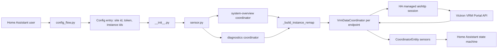

# Architecture - Victron VRM API Integration

> Living architecture document. Update this whenever endpoints, device flows, config keys, or shipped files change.

## Boundary

Only [custom_components/victron_vrm_api/](../custom_components/victron_vrm_api/) ships to Home Assistant users through HACS or manual install. Everything else is developer support material.

| Area | Ships | Purpose |
| :--- | :---: | :--- |
| [custom_components/victron_vrm_api/](../custom_components/victron_vrm_api/) | Yes | Home Assistant integration source |
| [docs/](.) | No | User docs, architecture, screenshots, risk tracking |
| [scripts/](../scripts/) | No | Local deployment helpers and operator notes |
| [tests/](../tests/) | No | API exploration and regression scripts |
| `api_data_*/` | No | Local captured VRM API payloads, ignored by git |
| `.env` | No | Local secrets, ignored by git |

## Runtime Flow

## Component Responsibilities

| File | Responsibility | Notes |
| :--- | :--- | :--- |
| [__init__.py](../custom_components/victron_vrm_api/__init__.py) | Config entry setup, platform forwarding, unload | Does not call VRM directly |
| [config_flow.py](../custom_components/victron_vrm_api/config_flow.py) | UI setup and reconfigure | Token fields are password selectors; reconfigure keeps current token when left blank |
| [const.py](../custom_components/victron_vrm_api/const.py) | Domain, config keys, scan intervals | Add new keys here first |
| [sensor.py](../custom_components/victron_vrm_api/sensor.py) | Coordinators, endpoint parsing, entity creation, sensor values | Keep endpoint-specific parsing local and explicit |
| [manifest.json](../custom_components/victron_vrm_api/manifest.json) | HA metadata and version | Bump version on release |
| [translations/](../custom_components/victron_vrm_api/translations/) | Config flow labels and descriptions | Update both English and German for new fields |

## Data Sources

Base URL: `https://vrmapi.victronenergy.com/v2/installations/{site_id}/`

| Endpoint | Used For | Interval Source |
| :--- | :--- | :--- |
| `system-overview` | Device list and metadata | `DEFAULT_SCAN_INTERVAL_SYSTEM_OVERVIEW` |
| `diagnostics` | Diagnostic records, enum-safe raw values, remap timestamps | `DEFAULT_SCAN_INTERVAL_OVERALL` |
| `overallstats` | Day/week/month/year totals | `DEFAULT_SCAN_INTERVAL_OVERALL` |
| `stats?type=kwh&interval=15mins` | Energy flow totals | `DEFAULT_SCAN_INTERVAL_OVERALL` |
| `widgets/BatterySummary` | Battery summary | `DEFAULT_SCAN_INTERVAL_BATTERY` |
| `widgets/HistoricData` | Battery history | `DEFAULT_SCAN_INTERVAL_BATTERY` |
| `widgets/BatteryMonitorWarningsAndAlarms` | Battery alarms | `DEFAULT_SCAN_INTERVAL_BATTERY` |
| `widgets/Status` | MultiPlus status | `DEFAULT_SCAN_INTERVAL_MULTI` |
| `widgets/PVInverterStatus` | PV inverter status | `DEFAULT_SCAN_INTERVAL_PV_INVERTER` |
| `widgets/TankSummary` | Tank status | `DEFAULT_SCAN_INTERVAL_TANK` |
| `diagnostics` tank records | Tank discovery and fallback values when tanks are absent from system-overview/widgets | `DEFAULT_SCAN_INTERVAL_OVERALL` |
| `widgets/SolarChargerSummary` | Solar charger status | `DEFAULT_SCAN_INTERVAL_SOLAR_CHARGER` |

## Instance Remap Design

VRM may reassign device instance IDs after a Cerbo restart or firmware update. Entity IDs and unique IDs remain pinned to the configured instance, while API URLs use the detected live instance.

Remap inputs:

| Input | Purpose |
| :--- | :--- |
| `system-overview.records.devices` | Lists visible devices and their current instance IDs |
| `diagnostics.records[].timestamp` | Distinguishes fresh live instances from stale listed instances |
| Configured instance IDs | Stable identity used for Home Assistant entities |

## Update Rules

- Fetch `system-overview` and `diagnostics` before dynamic widget coordinators.
- Use diagnostics timestamps for stale-instance detection when possible.
- Discover tanks from diagnostics because VRM may collect tank data without listing the tank in `system-overview`.
- Resolve enums through `dataAttributeEnumValues` and raw enum values before falling back to formatted text.
- Create sensors only when the API actually returns data for the relevant attribute.
- Keep HTTP calls async through Home Assistant's managed aiohttp session with a 15 second timeout.

## Architecture Change Checklist

- Update this document when adding endpoints, device types, config keys, or coordinators.
- Update [INVENTORY.md](../INVENTORY.md) when files or shipped boundaries change.
- Update [docs/security.md](security.md) for new risks, mitigations, or known pitfalls.
- Update [README.md](../README.md) and [docs/documentation.md](documentation.md) for user-facing behavior.
- Update [.github/copilot-instructions.md](../.github/copilot-instructions.md) when a rule should guide future agent work.